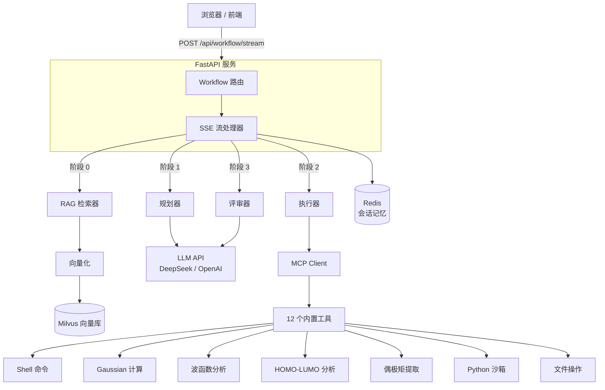

# Quantum Agent Platform

一个 LLM 驱动的量子化学自主 Agent 平台，通过 **LangGraph 工作流**编排量子化学工具（Gaussian、Multiwfn、EqV2），集成 **RAG 知识检索**、**SSE 流式反馈**和**自动重试机制**。

> 你可以把它理解为"能真的跑 Gaussian 计算的 ChatGPT"。

---

## 快速开始

### 前置条件

- **Python 3.11+**
- **Docker & Docker Compose**（运行 Milvus 向量库 + Redis）
- **Gaussian 16**（可选 — 需要运行量子化学计算时）
- **Multiwfn**（可选 — 需要波函数分析时）

### 5 分钟跑起来

```bash
# 1. 克隆项目
git clone <repo-url>
cd quantum-agent-platform

# 2. 安装 Python 依赖
pip install -r requirements.txt

# 3. 配置环境变量（复制模板，填入 API Key）
cp .env.example .env
# 编辑 .env → 至少填 LLM_API_KEY

# 4. 启动基础设施（Milvus + etcd + MinIO）
docker-compose up -d

# 5. 启动 Redis（如果 docker-compose 里还没加）
docker run -d --name quantum-redis -p 6379:6379 redis:7-alpine

# 6. 启动服务
uvicorn app.main:app --reload --host 0.0.0.0 --port 8000

# 7. 打开浏览器
# → http://localhost:8000
```

服务启动后，终端打印工具注册日志：

```text
[registry] [OK] bash
[registry] [OK] read_file
[registry] [OK] write_file
...
[registry] [OK] dipole
INFO: Uvicorn running on http://0.0.0.0:8000
```

---

## 整体架构



### 工作流四阶段

| 阶段 | 节点 | 干什么 |
|------|------|--------|
| **0. RAG** | Retriever | 把用户问题向量化 → 搜 Milvus → 返回相关知识片段 |
| **1. Plan** | Planner | LLM 把用户任务拆成 JSON 格式的可执行步骤 |
| **2. Execute** | Executor | 逐条调工具，失败自动重试 3 次 |
| **3. Critic** | Critic | LLM 评审执行结果 → 通过（结束）/ 不通过（回到阶段 2，最多 3 轮） |

---

## 项目结构

```
quantum-agent-platform/
├── app/                        # FastAPI 应用
│   ├── main.py                 # 入口：创实例 + 注册路由 + 全局异常处理
│   ├── routes/
│   │   ├── workflow.py         # ★ 核心：Agent 工作流（RAG→Plan→Exec→Critic），SSE 流式返回
│   │   └── chat.py             # 纯 LLM 对话（不经过 Agent 工作流）
│   ├── schemas/
│   │   └── request.py          # Pydantic 请求体模型
│   └── static/
│       └── index.html          # 前端页面
│
├── agent/                      # Agent 核心
│   ├── planner.py              # 任务拆解 → JSON 步骤计划
│   ├── executor.py             # 计划执行 + 重试
│   ├── critic.py               # 结果评审
│   ├── mcp_client.py           # 统一工具调用入口
│   ├── state.py                # Agent 有限状态机
│   └── prompts/
│       ├── planner_prompt.txt  # Planner 系统提示词
│       └── critic_prompt.txt   # Critic 系统提示词
│
├── tools/                      # 工具实现（12 个）
│   ├── register_all.py         # ★ 一键注册所有工具
│   ├── tool_register.py        # Tool 数据类 + 注册中心
│   ├── bash/runner.py          # Shell 命令执行
│   ├── file_tools/runner.py    # 文件读写/列表/删除
│   ├── python_repl/runner.py   # Python 沙箱（数据处理）
│   ├── grep_tool/runner.py     # 正则搜索 + 量化专用预设
│   ├── gaussian/runner.py      # Gaussian 16 提交
│   ├── multiwfn/runner.py      # Multiwfn 波函数分析
│   ├── eqv2/runner.py          # EqV2 构象搜索
│   ├── humo_lumo/runner.py     # HOMO-LUMO 能隙提取 (.fchk)
│   └── dip/runner.py           # 偶极矩/四极矩提取 (.out)
│
├── rag/                        # RAG 知识检索
│   ├── embedder.py             # 文本 → 向量（BGE-large-zh-v1.5，1024 维）
│   ├── vector_db.py            # Milvus 客户端（写入 + 相似搜索）
│   ├── retriever.py            # 串联：embed → search → 格式化上下文
│   ├── chunker.py              # 文档切分
│   └── ingestion.py            # 文档入库流水线
│
├── workflow/                   # LangGraph DAG 编排
│   ├── graph.py                # 构建工作流图
│   └── nodes/                  # 图节点（rag、plan、exec、critique）
│
├── llm/                        # LLM 调用封装
│   └── client.py               # OpenAI 兼容 API（支持流式/非流式）
│
├── db/                         # 数据层
│   ├── redis_client.py         # 会话历史存储（TTL=3600s）
│   └── models.py               # 数据模型
│
├── config/
│   └── settings.py             # 环境变量配置

├── docker-compose.yml          # Milvus + etcd + MinIO
├── requirements.txt            # Python 依赖
└── .env.example                # 环境变量模板
```

---

## 内置工具一览

| 工具名 | 类型 | 功能 | 关键参数 |
|------|------|------|----------|
| `bash` | 系统 | 执行 Shell 命令 | `command`（必填）、`cwd`、`timeout` |
| `read_file` | 文件 | 读取文件内容 | `path`（必填）、`max_lines` |
| `write_file` | 文件 | 写入/创建文件 | `path`（必填）、`content`（必填）、`append` |
| `list_dir` | 文件 | 列出目录内容 | `path`、`pattern`（如 `*.gjf`） |
| `delete_file` | 文件 | 删除指定文件 | `path`（必填） |
| `python_repl` | 数据处理 | Python 沙箱（预导入 math、json、re 等） | `code`（必填）、`timeout` |
| `grep_file` | 搜索 | 正则搜索 + 量化预设（能量、偶极矩、虚频等） | `path`（必填）、`pattern`、`preset` |
| `gaussian` | 量化计算 | 提交 Gaussian 16 任务 | `input_file`（必填）、`output_file`（必填） |
| `multiwfn` | 量化计算 | Multiwfn 波函数分析 | `input_file`（必填）、`commands`（必填） |
| `eqv2` | 量化计算 | EqV2 构象搜索 | `input_file`（必填）、`output_file`（必填） |
| `homo_lumo` | 分析 | 从 .fchk 提取 HOMO/LUMO 能隙 | `fchk_path`（必填）、`num_around` |
| `dipole` | 分析 | 从 .out 提取偶极矩/四极矩 | `out_path`（必填）、`extract_quadrupole`、`extract_traceless` |

---

## API 端点

| 方法 | 路径 | 说明 |
|------|------|------|
| `GET` | `/` | Web 前端页面 |
| `POST` | `/api/workflow/stream` | **Agent 工作流** — SSE 流式返回，实时展示进度 |
| `POST` | `/api/workflow/run` | Agent 工作流 — 一次性返回全部结果 |
| `POST` | `/api/chat/stream` | 纯 LLM 对话 — 不走 Agent，不调工具 |
| `POST` | `/api/chat/` | 纯 LLM 对话 — 一次性返回 |
| `GET` | `/api/health/server` | 健康检查 → `{"server": "running"}` |
| `GET` | `/api/status/ping` | Ping → `{"pong": true}` |

### 调用示例

```bash
curl -X POST http://localhost:8000/api/workflow/stream \
  -H "Content-Type: application/json" \
  -d '{
    "input_data": {"user_query": "在 ar1_relaxed_sp.out 中提取偶极矩"},
    "session_id": "demo-001"
  }'
```

SSE 事件流（实时推送）：

```text
event: rag_done         → RAG 知识库检索完成
event: thinking_chunk   → Planner 思考过程（逐 token）
event: plan_done        → 任务拆解 JSON 完成
event: step_start       → 开始执行某个工具
event: step_done        → 工具执行结果返回
event: verdict_done     → Critic 评审结果（pass / fail）
event: retry            → 失败，触发重试
event: done             → 工作流完成
event: error            → 捕获到异常（友好降级，不直接断连）
```

---

## 配置说明

所有配置通过 `.env` 环境变量设置：

| 变量 | 默认值 | 说明 |
|------|--------|------|
| `LLM_MODEL` | `deepseek-chat` | LLM 模型名 |
| `LLM_BASE_URL` | `https://api.deepseek.com` | LLM API 地址 |
| `LLM_API_KEY` | — | **必填** — API 密钥 |
| `EMBED_MODEL` | `BAAI/bge-large-zh-v1.5` | 向量化模型 |
| `EMBED_API_KEY` | — | **必填**（如需 RAG） |
| `REDIS_HOST` | `localhost` | Redis 地址 |
| `REDIS_PORT` | `6379` | Redis 端口 |
| `MILVUS_HOST` | `localhost` | Milvus 地址 |
| `MILVUS_PORT` | `19530` | Milvus gRPC 端口 |
| `MAX_RETRIES` | `3` | 最大重试轮数 |
| `MAX_STEPS` | `20` | 单次任务最大步骤数 |
| `CHUNK_SIZE` | `512` | RAG 文档切分大小 |
| `TOP_K` | `5` | RAG 检索返回条数 |

---

## 如何添加新工具

平台遵循 **7 步工具集成流程**：

```text
1. 写 runner 函数          → tools/<新工具名>/runner.py
2. 定义 JSON Schema        → name、description、parameters
3. 注册到工具中心           → tools/register_all.py
4. 接入 MCPClient          → （register_all 自动完成）
5. 更新 Planner 提示词      → agent/prompts/planner_prompt.txt
6. 更新 __init__.py         → tools/<新工具名>/__init__.py
7. 端到端测试               → 重启服务，前端验证
```

**标准 runner 函数签名：**

```python
def run_your_tool(必填参数: str, 可选参数: bool = False) -> str:
    """一句话描述工具功能"""
    # 1. 校验输入
    # 2. 干活
    # 3. 返回格式化结果字符串
    return "格式化结果..."
```

所有工具遵循统一范式：**文本进、文本出**，异常返回 `[ERROR] 描述` 字符串。参考实现：[tools/humo_lumo/runner.py](tools/humo_lumo/runner.py) / [tools/dip/runner.py](tools/dip/runner.py)。

---

## 常见问题

| 现象 | 可能原因 | 解决 |
|------|----------|------|
| `ModuleNotFoundError: No module named 'xxx'` | 缺少 Python 依赖 | `pip install -r requirements.txt` |
| `redis.exceptions.ConnectionError` | Redis 没启动 | `docker run -d --name quantum-redis -p 6379:6379 redis:7-alpine` |
| `pymilvus.exceptions.MilvusException` | Milvus 没启动 | `docker-compose up -d` |
| `UnicodeDecodeError: 'gbk' codec can't decode` | 代码里 `open()` 没指定 UTF-8 | 在 `open()` 调用里加上 `encoding="utf-8"` |
| 工具返回 `[ERROR] bad params` | LLM 生成的参数名和 Schema 不一致 | 检查 Planner 提示词里的参数名和工具注册时是否一致 |
| SSE 连接静默断开 | 工作流内部有未捕获异常 | 已修复 — 现在被外层 try/except 兜住，前端会收到 `error` 事件 |
| Agent 总是用 `grep_file` 而不是专用工具 | Planner 提示词里没写这个工具 | 在 `agent/prompts/planner_prompt.txt` 的量子化学工具区加上新工具 |
| 服务启动就报错 | Redis / Milvus 没启动，或 `.env` 没配 | 先跑 `docker-compose up -d` 和 Redis，确认 `.env` 里有 `LLM_API_KEY` |

---

## 设计原则

- **文本进、文本出** — 所有工具的返回都是纯文本字符串，LLM 可直接阅读
- **优雅降级** — 工具失败返回 `[ERROR]` 字符串，不崩进程
- **默认 3 次重试** — Executor 在放弃前自动重试失败的工具调用
- **全链路 SSE** — 流式响应让用户实时看到 Agent 的思考和执行过程
- **MCP 就绪** — 工具定义遵循 MCP JSON Schema 格式，未来可平滑升级为真正的 MCP Server

---

## 技术栈

| 层 | 技术选型 |
|----|----------|
| Web 框架 | FastAPI + SSE Streaming |
| 工作流编排 | LangGraph（DAG 有向无环图） |
| 大模型 | DeepSeek / OpenAI 兼容 API |
| 向量数据库 | Milvus 2.4 |
| 会话记忆 | Redis（session_id 为 key，TTL=3600s） |
| 向量化 | BGE-large-zh-v1.5（1024 维） |
| 前端 | 原生 HTML/CSS/JS（EventSource SSE） |

---

## License

MIT
